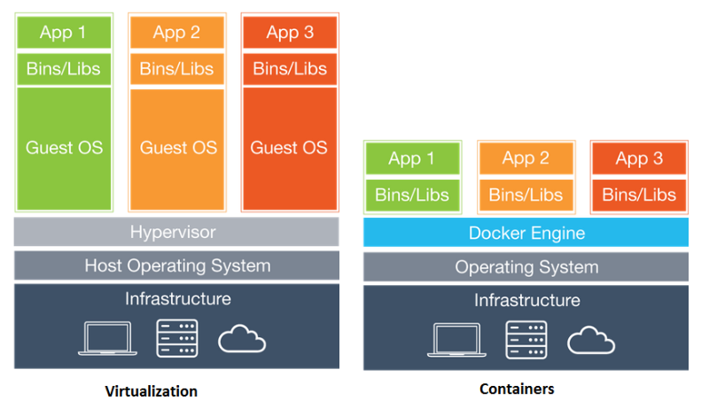

# Table of Contents

1. [Module 0-A: Install Docker Locally](https://hub.docker.com/?next=https%3A%2F%2Fhub.docker.com%2F)
2. [Module 0-B: Access your Docker Lab Development Box](./Module-0)
2. [Module 1: Running Docker Containers](./Module-1)
3. [Module 2: Creating Custom Images from Dockerfiles](./Module-2)
4. [Module 3: Using Docker Compose](./Module-3)

# Introduction 

> Source of Introduction: comes from an article published in [InfoWold](http://www.infoworld.com/article/3204171/linux/what-is-docker-linux-containers-explained.html)

[Docker containers](https://blog.docker.com/2016/05/docker-101-getting-to-know-docker/) are self-contained execution environments—with their own, isolated CPU, memory, block I/O, and network resources—that share the kernel of the host operating system. The result is **something that feels like a virtual machine, but sheds all the weight and startup overhead of a guest operating system.** 

To understand containers, we have to start with Linux [cgroups](https://sysadmincasts.com/episodes/14-introduction-to-linux-control-groups-cgroups) and [namespaces](http://blogs.igalia.com/dpino/2016/04/10/network-namespaces/), the Linux kernel features that create the walls between containers and other processes running on the host. Linux namespaces, originally developed by IBM, wrap a set of system resources and present them to a process to make it look like they are dedicated to that process.

In short: 

  * **Namespaces** :  Limits what the running process can see. I.E. processes can have their own view of the system’s resources.
  * **cgroups** :  Metering and limiting mechanism, they control how much of a system resource (CPU, memory) processes can use.

In comparison to virtual machines, containers feel and act like independent operating system environments, but are actually layered on top of an existing OS similar to how a VM would be on top of a hypervisor. A visual below is provided for contextual aid in comparison with traditional VM architecture vs a docker containerized architecture. 

  

In this tutorial, we are going to gain hands on experience and learn the basics of docker containers, images, commands, and automate deployment of a simple self dockerized [sandbox environment](https://github.com/Citrix-TechSpecialist/nitro-ide/tree/0206630bd6903887d599613a42dd65da550cc37e) to develop scripts to issue [NITRO](http://docs.citrix.com/ja-jp/netscaler/11/nitro-api.html) commands to your NetScaler ADCs. 

# Pre-requisites 

  * [Docker](https://docs.docker.com/engine/installation/)
  	* You must install Docker in your local environment to do this tutorial. Follow the instructions in the link provided to install Docker on your operating system. 
  	* If you are following along in a ILT course, skip ahead to [Module 0-B: Access your Docker Lab Development Box](./Module-0)
